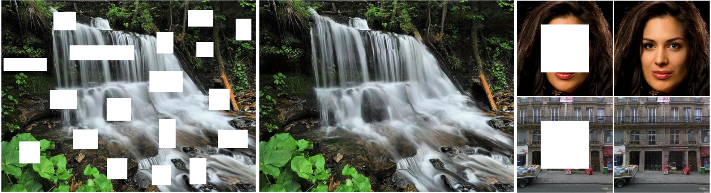
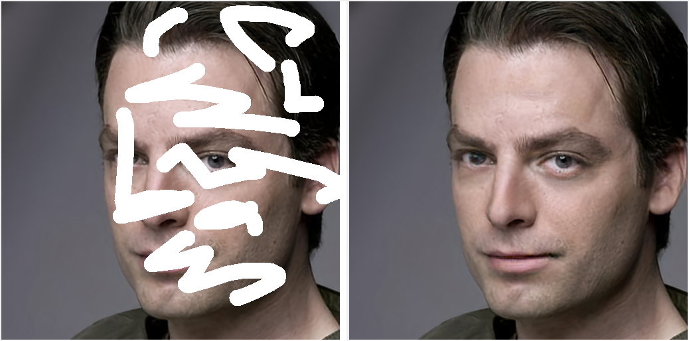
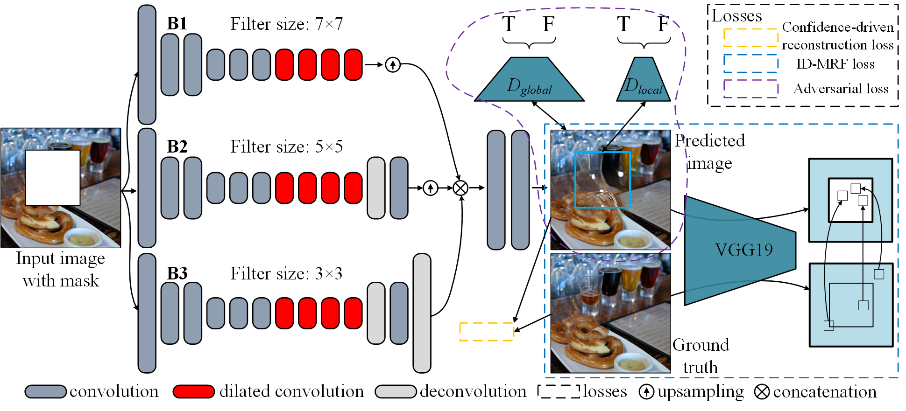
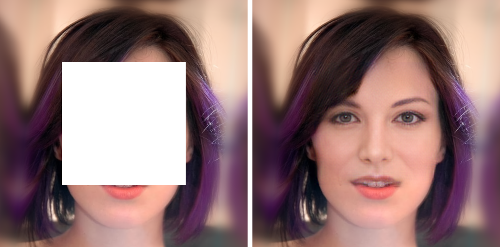
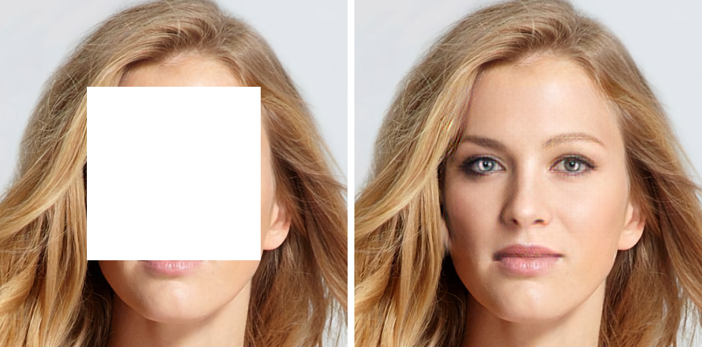
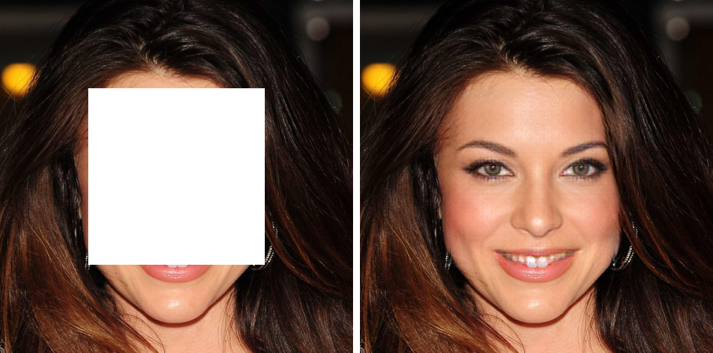
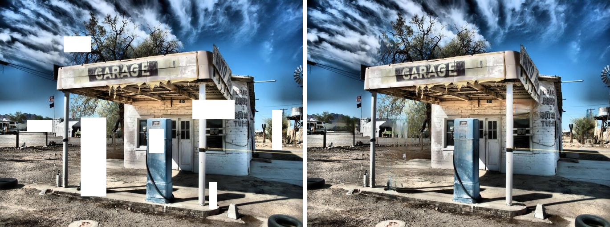
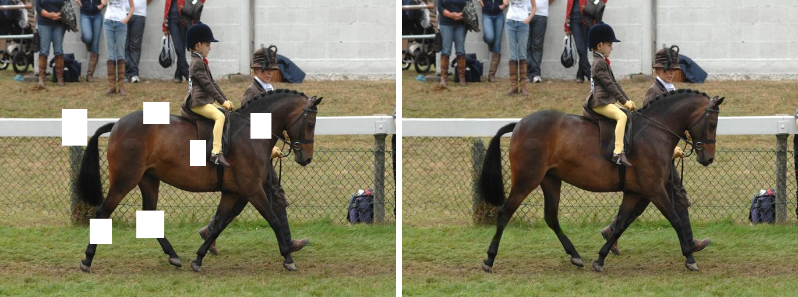
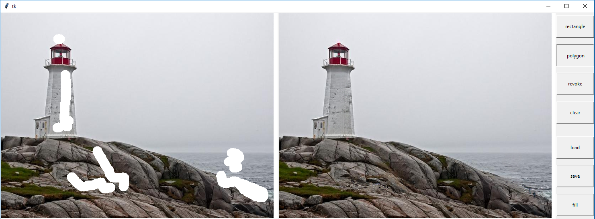

# Image Inpainting via Generative Multi-column Convolutional Neural Networks

by [Yi Wang](https://shepnerd.github.io/), [Xin Tao](http://www.xtao.website), [Xiaojuan Qi](https://xjqi.github.io), [Xiaoyong Shen](http://xiaoyongshen.me/), [Jiaya Jia](http://www.cse.cuhk.edu.hk/leojia/).

## Results on Places2, CelebA-HQ, and Paris streetview with rectangle masks.


## Results on Places2 and CelebA-HQ with random strokes.
<p></p>
<p></p>

## Introduction
This repository is for the NeurIPS 2018 paper, '[Image Inpainting via Generative Multi-column Convolutional Neural Networks](http://papers.nips.cc/paper/7316-image-inpainting-via-generative-multi-column-convolutional-neural-networks.pdf)'.

If our method is useful for your research, please consider citing:

    @inproceedings{wang2018image,
      title={Image Inpainting via Generative Multi-column Convolutional Neural Networks},
      author={Wang, Yi and Tao, Xin and Qi, Xiaojuan and Shen, Xiaoyong and Jia, Jiaya},
      booktitle={Advances in Neural Information Processing Systems},
      pages={329--338},
      year={2018}
    }

## Our framework



### Partial Results
<p> &nbsp;&nbsp;&nbsp;&nbsp; </p>

<p> &nbsp;&nbsp;&nbsp;&nbsp; </p>

<p></p>

<p></p>

### [More results](https://drive.google.com/file/d/1uzYgpiCkENTqW-Yy-AriHXH0wUidi3KY/view?usp=sharing)

## Prerequisites
- Python3.5 (or higher)
- Tensorflow 1.4 (or later versions, excluding 2.x) with NVIDIA GPU or CPU
- OpenCV
- numpy
- scipy
- easydict
- Pytorch 1.0 with NVIDIA GPU or CPU
- tensorboardX

## Installation

```bash
git clone https://github.com/shepnerd/inpainting_gmcnn.git
cd inpainting_gmcnn/tensorflow
```
or
```bash
cd inpainting_gmcnn/pytorch
```

## For tensorflow implementations
### Testing

Download pretrained models through the following links ([paris_streetview](https://drive.google.com/file/d/1wgesxSUfKGyPwGQMw6IXZ9GLeZ7YNQxu/view?usp=sharing), [CelebA-HQ_256](https://drive.google.com/file/d/1zvMMzMCXNxzbYJ_6SEwt3hUShD3Xnz9W/view?usp=sharing), [CelebA-HQ_512](https://drive.google.com/file/d/1cp5e8XyXmHNZWj_piHH4eg4HFi3ICl0l/view?usp=sharing), [Places2](https://drive.google.com/file/d/1aakVS0CPML_Qg-PuXGE1Xaql96hNEKOU/view?usp=sharing)), and unzip and put them into `checkpoints/`. To test images in a folder, you can specify the folder address by the opinion `--dataset_path`, and set the pretrained model path by `--load_model_dir` when calling `test.py`.

For example:

```bash
python test.py --dataset paris_streetview --data_file ./imgs/paris-streetview_256x256/ --load_model_dir ./checkpoints/paris-streetview_256x256_rect --random_mask 0
```
or
```bash
sh ./script/test.sh
```

### Training
For a given dataset, the training is formed of two stages. We pretrain the whole network with only confidence-driven reconstruction loss first, and finetune this network using adversarial and ID-MRF loss along with the reconstruction loss after the previous phase converges.

To pretrain the network,
```shell
python train.py --dataset [DATASET_NAME] --data_file [DATASET_TRAININGFILE] --gpu_ids [NUM] --pretrain_network 1 --batch_size 16
```
where `[DATASET_TRAININGFILE]` indicates a file storing the full paths of the training images.

Then finetune the network,
```shell
python train.py --dataset [DATASET_NAME] --data_file [DATASET_TRAININGFILE] --gpu_ids [NUM] --pretrain_network 0 --load_model_dir [PRETRAINED_MODEL_PATH] --batch_size 8
```
We provide both random <b>stroke</b> and <b>rectangle</b> masks in the training and testing phase. The used mask type is indicated by specifying `--mask_type [rect(default)|stroke]` option when calling `train.py` or `test.py`.

### A simple interactive inpainting GUI

A GUI written using tkinter is given in `painter_gmcnn.py`. Start it by calling
```shell
sh ./script/vis_tool.sh
```

## For pytorch implementations
The testing and training procedures are similar to these in the tensorflow version except some parameters are with different names.
### Testing
A pretrained model: [CelebA-HQ_256](https://drive.google.com/file/d/1lx0BHKQ-GsbFu60ocYm4wK1HVfv7uean/view?usp=sharing).

### Training
Compared with the tensorflow version, this pytorch version would expect a relatively smaller batch size for training.

## Other versions
Checkout the keras implementation of our paper by Tomasz Latkowski [here](https://github.com/tlatkowski/inpainting-gmcnn-keras).

## Disclaimer

- For the provided pretrained models, their performance would degrade obviously when they are evaluated by a mask whose unknown areas are too large.
- As claimed in the paper, for the large datasets with thousands of categories, the model performance is unstable. Recent GAN using large-scale techniques may ease this problem.
- We did not give the full implementation of ID-MRF (in this repo) described in our original paper. The step of excluding `s` is omitted for computational efficiency.
- In the pytorch version, a different GAN loss (wgan hinge loss with spectral normalization) is adopted.

## Acknowledgments
Our code is partially based on [Generative Image Inpainting with Contextual Attention](https://github.com/JiahuiYu/generative_inpainting) and [pix2pixHD](https://github.com/NVIDIA/pix2pixHD). The implementation of id-mrf loss is borrowed from [contextual loss](https://github.com/roimehrez/contextualLoss).

### Contact

Please send email to yiwang@cse.cuhk.edu.hk.
